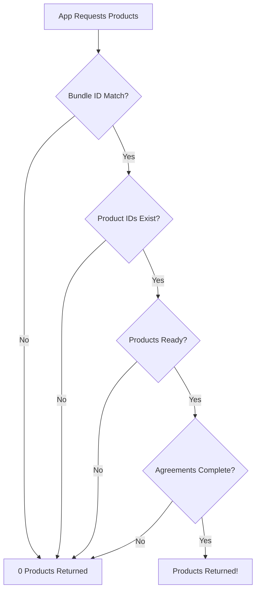

# IAP Troubleshooting: 0 Products Fetched

## Current Issue

You're seeing:
```
LOG  IAP: Connection initialized successfully
LOG  IAP: Fetching products: ["com.hexerve.AnimateMemories.credits.starter", "com.hexerve.AnimateMemories.credits.popular", "com.hexerve.AnimateMemories.credits.pro"]
LOG  IAP: Fetched products: 0
```

This means the IAP system is working, but App Store doesn't recognize your product IDs.

---

## ✅ Checklist: Fix 0 Products Issue

### 1. Verify Product IDs Match EXACTLY

**In App Store Connect:**
1. Go to [App Store Connect](https://appstoreconnect.apple.com)
2. Select your app
3. Click **Features** → **In-App Purchases**
4. For EACH product, verify the **Product ID** matches:

| Expected Product ID | Status Should Be |
|---------------------|------------------|
| `com.hexerve.AnimateMemories.credits.starter` | Ready to Submit or Approved |
| `com.hexerve.AnimateMemories.credits.popular` | Ready to Submit or Approved |
| `com.hexerve.AnimateMemories.credits.pro` | Ready to Submit or Approved |

**IMPORTANT:** 
- Product IDs are **case-sensitive**
- Must match **character-for-character** (including dots)
- Cannot be changed after creation

❌ **If Product IDs don't match:**
- You'll need to delete and recreate them with correct IDs
- OR update your code to match the existing IDs

---

### 2. Complete ALL Product Metadata

For **EACH** of the 3 products, ensure you have:

#### Required Fields:
- ✅ **Reference Name**: e.g., "Starter Pack - 30 Credits"
- ✅ **Product ID**: `com.hexerve.AnimateMemories.credits.starter`
- ✅ **Type**: Consumable
- ✅ **Cleared for Sale**: Toggle ON

#### Pricing and Availability:
- ✅ **Price Tier** selected (at least for one territory/country)
  - Starter: Tier 10 ($9.99)
  - Popular: Tier 25 ($24.99)
  - Pro: Tier 45 ($44.99)

#### Localization (English - U.S.):
- ✅ **Display Name**: "30 AI Credits - Starter Pack"
- ✅ **Description**: Any text (minimum required)

#### App Store Review Information:
- ✅ **Screenshot**: Upload ANY screenshot (can be placeholder)
  - This is REQUIRED for "Ready to Submit" status
  - Minimum size: 640x920
  - Can be a screenshot of your credit screen

**After entering all fields:**
- Click **Save** in top-right corner
- Status should change to **"Ready to Submit"**

---

### 3. Check Agreements & Banking

This is THE MOST CRITICAL step. IAP will NOT work (even in sandbox) without this.

**Steps:**
1. Go to [App Store Connect](https://appstoreconnect.apple.com) homepage
2. Click **Agreements, Tax, and Banking**

#### Paid Applications Agreement:
- ✅ **Status**: Active (green checkmark)
- ✅ **Contracts In Effect**: At least 1

#### Banking Information:
- ✅ **Status**: Complete with **green checkmark**
- ✅ Bank account added for receiving payments
- ✅ Wait time: 24-48 hours for approval after submission

#### Tax Information:
- ✅ **Status**: Complete with **green checkmark**
- ✅ Tax forms completed (W-9 for US, W-8BEN for non-US)
- ✅ Wait time: 24-48 hours for approval after submission

**If ANY of these are incomplete:**
- Products will return 0 even if configured correctly
- Complete these FIRST before testing again

---

### 4. Wait for Propagation

**New Products:**
- After creating products: Wait **2-24 hours**
- Apple's servers need time to propagate product data

**Modified Products:**
- After updating metadata: Wait **1-2 hours**

**During this wait:**
- Products may intermittently work or not work
- This is normal behavior

---

### 5. Verify Bundle ID

**Check in App Store Connect:**
1. Your app → **App Information**
2. Bundle ID should be: `com.hexerve.AnimateMemories`

**Check in your code (app.json):**
```json
"ios": {
  "bundleIdentifier": "com.hexerve.AnimateMemories"
}
```

✅ Both match - this looks correct!

---

## 🔧 Testing Steps

### Step 1: Run Updated App

With the enhanced logging I just added, you'll now see:

```
LOG  IAP: Fetching products: [...]
LOG  IAP: Bundle ID should be: com.hexerve.AnimateMemories
LOG  IAP: Response code: [number]
LOG  IAP: Response code OK? true/false
LOG  IAP: Raw results: [...]
```

### Step 2: Check the Response Code

The response code tells us what's happening:

| Response Code | Meaning | Action |
|--------------|---------|--------|
| `0` (OK) | Success, but results empty | Products not configured |
| `1` (USER_CANCELED) | N/A for fetch | - |
| `2` (ERROR) | System error | Check agreements/banking |
| Other | Unknown | Report to support |

### Step 3: Check Raw Results

If `results` is:
- `[]` or `null` → Products not found
- `[...]` with data → Products found!

---

## 🎯 Most Likely Solutions (Ranked)

Based on your setup, here's what to check **IN THIS ORDER**:

### 1. Products Not "Ready to Submit" (70% likely)
**Symptom:** Products exist but metadata incomplete

**Fix:**
1. Open each product in App Store Connect
2. Ensure ALL fields are filled
3. **CRITICAL**: Upload a screenshot for App Review
4. Click **Save**
5. Status should change to "Ready to Submit"

### 2. Agreements/Banking Not Complete (20% likely)
**Symptom:** Shows "Cannot complete purchase" or 0 products

**Fix:**
1. Complete banking and tax forms
2. Wait 24-48 hours for approval
3. Check for approval email from Apple

### 3. Product IDs Mismatch (5% likely)
**Symptom:** Products configured but IDs don't match

**Fix:**
Check product IDs in App Store Connect vs. code

### 4. Propagation Delay (5% likely)
**Symptom:** Just created products

**Fix:**
Wait 2-24 hours, then test again

---

## 🚨 Common Mistakes

### ❌ Mistake 1: No Screenshot Uploaded
Products won't be "Ready to Submit" without a review screenshot.

**Fix:** Upload ANY screenshot in the "App Store Review Information" section.

### ❌ Mistake 2: No Price Tier Selected
Products need pricing for at least one country.

**Fix:** Add pricing for "All Territories" or at least one country.

### ❌ Mistake 3: Banking Pending
Even if submitted, banking approval can take 48 hours.

**Fix:** Check email for approval from Apple.

### ❌ Mistake 4: Testing on Simulator
Simulators can have issues with IAP.

**Fix:** Test on a real iOS device.

### ❌ Mistake 5: Wrong Product IDs
Even one wrong character breaks the match.

**Fix:** Copy-paste product IDs, don't type them.

---

## 📋 Quick Diagnostic

Run through this **5-minute checklist**:

```
[ ] 1. Agreements: Check App Store Connect → Agreements page
    Status should be: ✅ Active, ✅ Banking Complete, ✅ Tax Complete

[ ] 2. Products exist: App Store Connect → Your App → Features → IAP
    Should see 3 products listed

[ ] 3. Product IDs: Click each product, verify exact IDs:
    [ ] com.hexerve.AnimateMemories.credits.starter
    [ ] com.hexerve.AnimateMemories.credits.popular
    [ ] com.hexerve.AnimateMemories.credits.pro

[ ] 4. Product Status: Each product should show:
    Status: "Ready to Submit" or "Approved"

[ ] 5. Product Metadata: For each product:
    [ ] Display Name: Filled
    [ ] Description: Filled
    [ ] Price: At least one tier selected
    [ ] Screenshot: Uploaded

[ ] 6. Bundle ID: Matches in both places:
    [ ] App Store Connect: com.hexerve.AnimateMemories
    [ ] app.json: com.hexerve.AnimateMemories

[ ] 7. Wait Time: If just created/modified:
    [ ] Waited at least 2 hours? (If no, wait and retry)
```

---

## 🔍 Enhanced Logging Output

After running your app again with the updated code, you should see:

### ✅ Success Output:
```
LOG  IAP: Fetching products: ["com.hexerve.AnimateMemories.credits.starter", ...]
LOG  IAP: Response code: 0
LOG  IAP: Response code OK? true
LOG  IAP: Raw results: [{"productId": "com.hexerve...", "title": "...", ...}]
LOG  IAP: Fetched products: 3
LOG  ✅ IAP: Successfully fetched products:
LOG    - com.hexerve.AnimateMemories.credits.starter: 30 AI Credits - Starter Pack ($9.99)
LOG    - com.hexerve.AnimateMemories.credits.popular: 100 AI Credits - Popular Pack ($24.99)
LOG    - com.hexerve.AnimateMemories.credits.pro: 200 AI Credits - Pro Pack ($44.99)
```

### ⚠️ Failure Output (with hints):
```
LOG  IAP: Fetching products: ["com.hexerve.AnimateMemories.credits.starter", ...]
LOG  IAP: Response code: 0
LOG  IAP: Response code OK? true
LOG  IAP: Raw results: []
LOG  IAP: Fetched products: 0
WARN ⚠️ IAP: 0 products fetched. Possible reasons:
WARN   1. Product IDs in App Store Connect don't match code
WARN   2. Products not "Ready to Submit" in App Store Connect
WARN   3. Agreements/Banking/Tax not completed
WARN   4. Products just created (wait 2-24 hours for propagation)
WARN   5. Bundle ID mismatch
```

---

## 📞 Next Steps

### After checking everything above:

1. **Take a screenshot** of your App Store Connect IAP page showing:
   - All 3 products listed
   - Each product's ID
   - Each product's status

2. **Check the console output** with the new enhanced logging

3. **Report back** what you see in the logs, specifically:
   - Response code
   - Raw results
   - Any error messages

This will help pinpoint the exact issue.

---

## 🎓 Understanding the Flow



Your issue is at one of steps B, D, E, or F above.

---

## 🔗 Helpful Links

- **App Store Connect**: https://appstoreconnect.apple.com
- **Apple IAP Guide**: https://developer.apple.com/in-app-purchase/
- **Receipt Validation**: https://developer.apple.com/documentation/appstorereceipts

---

**Last Updated:** January 2026
